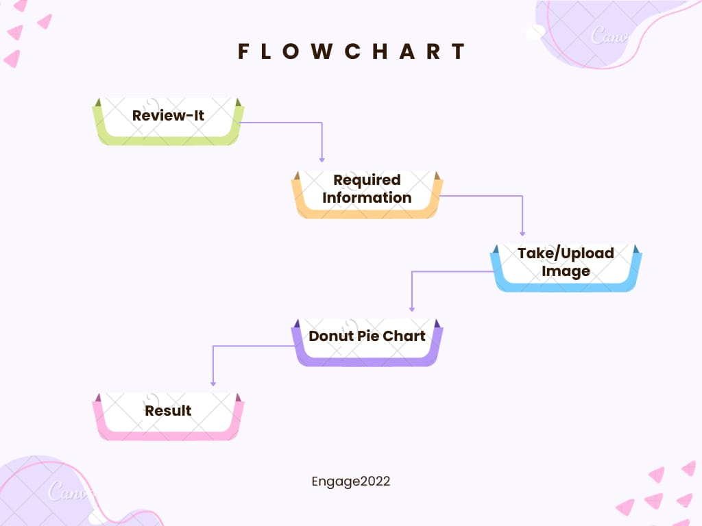

# Microsoft-Engage-22-Project
   
## Review-It (Feeedback Application)
### 🚩 Overview 
In Auditorium and Online Meets like Microsoft Teams, After ending the session Students gives feedback manually using different online forms. This forms takes students identities like their Email id, Name and Other Informations. For this reason Students always gives positive Feedback. To Avoid This I Built an Android Application That Recognizes users Facial Emotions Using Tensorflow lite Library. This gives us recognition of an emotions as Happy, Sad, Neutral, Surprise, Angry, Fear, Disgust.
Out of these all emotion recognitions, I selected Happy, Neutral & Surprise as a positive response and Sad, Angry, Fear & Disgust for the negative response.


## Installation/Environment Setup 

 #### Clone App
 

  
  * Make a new folder and open the terminal there.
  * Write the following command and press enter.
  
  ```bash
  https://github.com/SatyamGarde/Microsoft-Engage-22-Project.git
  $ cd EmotionRecognition-master
```
* Now just Open the EmotionRecognition-master Folder in Android Studio.


 
## 🔗 Links for project:
 Video link :
 
 <a href="https://drive.google.com/drive/folders/1OnFm_Ip1QzhmwDOo3zDeeCvc5GPqWkfp?usp=sharing" target="_blank">~~~**Watch Project Demo Video**~~~</a>

*Download Android App

<a href="https://drive.google.com/drive/folders/1OnFm_Ip1QzhmwDOo3zDeeCvc5GPqWkfp?usp=sharing" target="_blank">~~~**Download Application**~~~</a>


## 🌐 Flow Chart

 </img>


##  🚩 Technologies used:
<p align="left"> <a href="https://developer.android.com" target="_blank" rel="noreferrer">  </a> <a href="https://www.figma.com/" target="_blank" rel="noreferrer">  </a> <a href="https://firebase.google.com/" target="_blank" rel="noreferrer">  </a> <a href="https://git-scm.com/" target="_blank" rel="noreferrer">  </a> <a href="https://www.java.com" target="_blank" rel="noreferrer">  </a> <a href="https://www.tensorflow.org" target="_blank" rel="noreferrer">  </a> </p>


## 🚩 Future Scopes:-
Used In | Explanation
------------ | -------------
Online Meets Like Microsoft Teams| It is of great use in collecting the feedback digitally in online meeting applications Like 'Microsoft Teams'.   
Auditorium and Movie Theaters | It can be used in Auditorium or Movie Theaters for collecting feedback about the show.
Schools & Colleges | It has also Scope in Schools and colleges for taking productive feedback.

Thank you ! Microsoft Team for such a wonderful mentorship program ❤️
